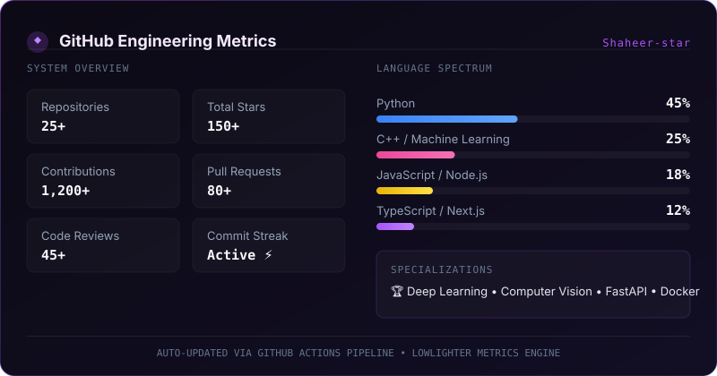

  <!-- HERO BANNER -->
  

    

  <!-- TYPING SVG -->
  

    

  <!-- BADGES & METRICS COUNTERS -->
  
  
  
  

    

  
  
  
  
  

 

<!-- ABOUT SECTION -->
<h2>💻 About</h2>

  <table width="100%">
    <tr>
      <td bgcolor="#0d0b18" style="border: 1px solid #7c3aed; border-radius: 12px; padding: 18px;">
<pre style="font-family: 'JetBrains Mono', monospace; font-size: 13px; color: #e9d5ff; margin: 0; line-height: 1.6;">
┌────────────────────────────────────────────────────────────────────────────────────────┐
│ Name               : Syed Shaheer Abbas                                                │
│ Role               : AI Engineer & Full Stack Developer                                │
│ Location           : Pakistan                                                          │
│ Core Focus         : Machine Learning • Computer Vision • Generative AI • LLMs         │
│ Tech Stack         : Python • C++ • FastAPI • PyTorch • TensorFlow • React • Docker    │
│ Currently Building : Enterprise AI Systems & Scalable Machine Learning Applications    │
│ Open To            : AI Engineering, Computer Vision & Product Development Roles       │
└────────────────────────────────────────────────────────────────────────────────────────┘
</pre>
      </td>
    </tr>
  </table>

 

<!-- TECH STACK SECTION -->
<h2>⚡ Tech Stack</h2>

  

 

<!-- FEATURED PROJECTS SECTION -->
<h2>🚀 Featured Projects</h2>

  <table width="100%">
    <thead>
      <tr style="background-color: #1e1b4b; color: #f3e8ff; font-family: sans-serif;">
        <th align="left">Project</th>
        <th align="left">Description</th>
        <th align="center">Stack</th>
        <th align="center">Repository</th>
        <th align="center">Live Demo</th>
      </tr>
    </thead>
    <tbody>
      <tr>
        <td><b>AgriVision Pro</b></td>
        <td>AI system for computer vision crop monitoring and real-time plant disease detection.</td>
        <td align="center"><code>PyTorch</code> <code>OpenCV</code> <code>FastAPI</code></td>
        <td align="center">
          
        </td>
        <td align="center">
          
        </td>
      </tr>
      <tr>
        <td><b>SupplySync</b></td>
        <td>Intelligent supply chain & inventory optimization engine powered by predictive ML models.</td>
        <td align="center"><code>Python</code> <code>FastAPI</code> <code>PostgreSQL</code></td>
        <td align="center">
          
        </td>
        <td align="center">
          
        </td>
      </tr>
      <tr>
        <td><b>Healthcare AI</b></td>
        <td>Clinical decision support dashboard utilizing Generative AI and medical imaging classification.</td>
        <td align="center"><code>TensorFlow</code> <code>LangChain</code> <code>React</code></td>
        <td align="center">
          
        </td>
        <td align="center">
          
        </td>
      </tr>
      <tr>
        <td><b>Netflix Analytics</b></td>
        <td>High-throughput streaming content analytics & recommendation platform with real-time dashboards.</td>
        <td align="center"><code>Node.js</code> <code>Next.js</code> <code>MongoDB</code></td>
        <td align="center">
          
        </td>
        <td align="center">
          
        </td>
      </tr>
    </tbody>
  </table>

 

<!-- GITHUB METRICS SECTION (FULL LOWLIGHTER METRICS DASHBOARD) -->
<h2>📊 GitHub Metrics</h2>

  

 

<!-- GITHUB ANALYTICS SECTION -->
<h2>📈 GitHub Analytics</h2>

  <table border="0">
    <tr>
      <td width="50%" align="center">
        
      </td>
      <td width="50%" align="center">
        
      </td>
    </tr>
  </table>

 

<!-- CONTRIBUTION GRAPH SECTION -->
<h2>📅 Contribution Graph</h2>

  

 

<!-- SNAKE SECTION -->
<h2>🐍 Snake</h2>

  <picture>
    <source media="(prefers-color-scheme: dark)" srcset="https://raw.githubusercontent.com/Shaheer-star/Shaheer-star/output/github-contribution-grid-snake-dark.svg">
    <source media="(prefers-color-scheme: light)" srcset="https://raw.githubusercontent.com/Shaheer-star/Shaheer-star/output/github-contribution-grid-snake.svg">
    
  </picture>

 

<!-- CODING PROFILES SECTION -->
<h2>🏆 Coding Profiles</h2>

  
  &nbsp;
  
  &nbsp;
  
  &nbsp;
  

 

<!-- CONNECT SECTION -->
<h2>💬 Connect</h2>

  
  &nbsp;
  
    
  
  &nbsp;
  

 

<!-- FOOTER SECTION -->

  

