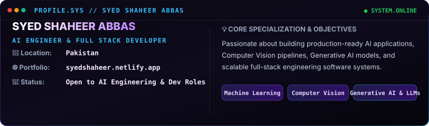

  <!-- HERO BANNER -->
  

    

  <!-- ANIMATED TYPING SVG -->
  

    

  <!-- PROFESSIONAL BADGES & METRICS COUNTERS -->
  
  
  
  
  
  
  

 

<!-- ABOUT CARD -->

  

 

<!-- TECH STACK SECTION -->

  

 

<!-- GITHUB METRICS DASHBOARD -->

  

 

<!-- SIDE-BY-SIDE ANALYTICS (STREAK & TOP LANGUAGES) -->

  <table border="0" width="100%">
    <tr>
      <td width="50%" align="center" valign="top">
        
      </td>
      <td width="50%" align="center" valign="top">
        
      </td>
    </tr>
  </table>

 

<!-- CONTRIBUTION ACTIVITY GRAPH -->

  

 

<!-- SNAKE ANIMATION -->

  <picture>
    <source media="(prefers-color-scheme: dark)" srcset="https://raw.githubusercontent.com/Shaheer-star/Shaheer-star/output/github-contribution-grid-snake-dark.svg">
    <source media="(prefers-color-scheme: light)" srcset="https://raw.githubusercontent.com/Shaheer-star/Shaheer-star/output/github-contribution-grid-snake.svg">
    
  </picture>

 

<!-- CONNECT BUTTONS -->

  
  &nbsp;
  
  &nbsp;
  
  &nbsp;
  

 

<!-- FOOTER -->

  

